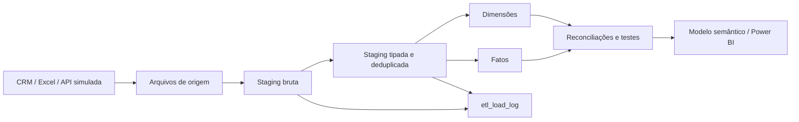

# Guia de implementação — Trilha A: Dados

> **Projeto:** BI Comercial e Funil de Prospecção  
> **Fonte:** `01-bi-comercial-prospeccao.pdf`  
> **Objetivo da trilha:** gerar dados sintéticos realistas, modelar o esquema relacional, implementar cargas incrementais e criar reconciliações entre origem e destino.

## 1. Resultado esperado

Ao concluir este guia, o projeto deverá possuir:

1. uma base sintética reproduzível com sazonalidade, correlações de negócio e anomalias controladas;
2. arquivos de origem em CSV/Parquet, representando CRM, planilha e API simulada;
3. um modelo dimensional em SQLite ou PostgreSQL;
4. chaves primárias, chaves de negócio, chaves estrangeiras e regras de integridade;
5. uma camada de `staging` separada da camada dimensional;
6. carga inicial e carga incremental idempotente;
7. tabela de logs de execução;
8. consultas de reconciliação, qualidade e fechamento do funil;
9. evidências para documentar o pipeline e alimentar o dashboard Power BI.

O fluxo final da Trilha A é:



---

## 2. Pré-requisitos

### 2.1 Ferramentas

- Python 3.11 ou superior;
- `pandas`, `numpy` e `pyarrow`;
- SQLite para uma implementação leve e reproduzível, ou PostgreSQL para uma arquitetura mais próxima de produção;
- Git;
- opcionalmente Power BI Desktop para consumo dos dados.

Instalação:

```bash
python3 -m pip install pandas numpy pyarrow
```

Validação do ambiente:

```bash
python3 --version
python3 -c "import pandas, numpy, pyarrow; print('dependências OK')"
```

### 2.2 Estrutura recomendada

```text
bi-comercial-prospeccao/
├── data/
│   ├── raw/                 # entradas brutas por sistema
│   ├── staging/             # arquivos intermediários
│   └── sample/              # amostras finais CSV/Parquet
├── database/
│   └── bi_comercial.sqlite
├── sql/
│   ├── 01_schema.sql
│   ├── 02_staging.sql
│   ├── 03_load_dimensions.sql
│   ├── 04_load_facts.sql
│   └── 05_reconciliation.sql
├── src/
│   ├── generate_dataset.py
│   └── etl/
│       ├── extract.py
│       ├── transform.py
│       ├── load.py
│       └── validate.py
├── tests/
│   └── test_data_quality.py
├── docs/
│   └── guia-trilha-a.md
└── README.md
```

No estado atual do projeto, o gerador principal já está em `src/generate_dataset.py` e os arquivos finais estão em `data/sample/`.

---

## 3. Passo 1 — Definir o contrato de dados

Antes de gerar ou carregar registros, documente a granularidade de cada tabela. Essa definição evita misturar entidades e fatos em uma única tabela e orienta todas as reconciliações.

| Tabela | Granularidade | Chave primária | Chaves de negócio / relacionamentos |
|---|---|---|---|
| `dim_date` | um registro por dia | `date_key` | `date` única |
| `dim_lead` | um registro por lead | `lead_key` | `lead_id_business` único |
| `dim_sales_rep` | um registro por vendedor | `sales_rep_key` | vendedor/rede comercial |
| `dim_channel` | um registro por canal | `channel_key` | `channel_name` |
| `fact_interaction` | uma interação realizada | `interaction_key` | `lead_key`, vendedor e canal |
| `fact_opportunity` | uma oportunidade comercial | `opportunity_key` | `opportunity_id_business` único |
| `fact_revenue` | uma realização de receita | `revenue_key` | `opportunity_key` |
| `etl_load_log` | uma execução por tabela/origem | `load_log_key` | controle operacional |

### 3.1 Regras de negócio da Trilha A

1. Todo lead deve ter uma data de entrada, canal, vendedor, região e segmento.
2. `is_sql = true` só pode ocorrer quando `is_mql = true`.
3. Uma oportunidade só pode ser criada para um lead SQL.
4. Uma receita só pode existir para uma oportunidade `Won`.
5. O valor de uma oportunidade não ganha deve ser zero em `won_value_brl`.
6. Oportunidades `Open` podem não ter `close_date`.
7. Datas de interação não devem ser anteriores à entrada do lead.
8. Datas futuras devem ser rejeitadas ou encaminhadas para uma fila de exceções.
9. Chaves de negócio devem ser únicas na respectiva entidade.
10. Anomalias não devem ser apagadas silenciosamente: devem ser preservadas e marcadas em `anomaly_flag`.

---

## 4. Passo 2 — Gerar a base sintética

O script usa uma semente fixa (`20261005`) para que qualquer pessoa consiga reproduzir exatamente a mesma base.

Execute a partir da raiz do projeto:

```bash
python3 src/generate_dataset.py
```

A geração produz:

```text
data/sample/
├── dim_date.csv / .parquet
├── dim_lead.csv / .parquet
├── dim_sales_rep.csv / .parquet
├── dim_channel.csv / .parquet
├── fact_interaction.csv / .parquet
├── fact_opportunity.csv / .parquet
├── fact_revenue.csv / .parquet
└── validation.json
```

### 4.1 Como a geração representa o negócio

O gerador não usa aleatoriedade uniforme pura:

- entradas de leads recebem pesos por mês e redução nos finais de semana;
- canal influencia qualidade e conversão;
- segmento influencia porte da empresa, probabilidade de oportunidade e valor do contrato;
- score influencia as passagens para MQL e SQL;
- número de interações depende do estágio do lead;
- tempo de resposta segue uma distribuição lognormal, adequada para variáveis positivas com cauda longa;
- valores de oportunidade seguem uma distribuição lognormal por segmento;
- descontos são gerados por uma distribuição normal truncada;
- anomalias são geradas em proporções controladas e ficam identificadas por `anomaly_flag`.

### 4.2 Critério de aceite da geração

A execução deve retornar aproximadamente:

| Indicador | Resultado esperado da execução atual |
|---|---:|
| Leads | 30.000 |
| Interações | 86.139 |
| Oportunidades | 2.351 |
| Receitas | 1.138 |
| MQL | 11.335 |
| SQL | 5.700 |
| Receita total | R$ 88.363.334,87 |

Pequenas diferenças são aceitáveis se `SEED`, período ou volume forem alterados intencionalmente.

---

## 5. Passo 3 — Separar as fontes de origem

Para simular a arquitetura do PDF (`CRM/API + Excel → staging`), copie ou exporte os arquivos para diretórios de origem separados.

```bash
mkdir -p data/raw/crm data/raw/excel data/raw/api

cp data/sample/dim_lead.csv data/raw/crm/leads_2025.csv
cp data/sample/fact_opportunity.csv data/raw/crm/opportunities_2025.csv
cp data/sample/fact_interaction.csv data/raw/crm/interactions_2025.csv
cp data/sample/dim_sales_rep.csv data/raw/crm/sales_reps.csv
cp data/sample/dim_channel.csv data/raw/excel/channels.csv
cp data/sample/fact_revenue.csv data/raw/api/revenue_2025.json.csv
```

Em uma simulação mais realista, altere somente o layout da origem e faça a etapa de transformação padronizar os nomes. Por exemplo:

| Origem | Campo de origem | Campo canônico |
|---|---|---|
| CRM | `id_lead` | `lead_id_business` |
| Excel | `Canal` | `channel_name` |
| API | `amount` | `amount_brl` |
| CRM | `created_at` | `created_date` |

A camada de origem deve ser imutável. Não corrija o arquivo bruto diretamente; registre a correção na transformação ou na tabela de exceções.

---

## 6. Passo 4 — Criar o esquema relacional

O SQLite é suficiente para demonstrar o projeto em portfólio e facilita a reprodução local. Crie o banco:

```bash
mkdir -p database
sqlite3 database/bi_comercial.sqlite
```

Ative integridade referencial:

```sql
PRAGMA foreign_keys = ON;
```

### 6.1 Tabelas de controle e staging

```sql
CREATE TABLE IF NOT EXISTS etl_load_log (
    load_log_key INTEGER PRIMARY KEY AUTOINCREMENT,
    pipeline_name TEXT NOT NULL,
    source_system TEXT NOT NULL,
    source_file TEXT,
    target_table TEXT NOT NULL,
    load_type TEXT NOT NULL CHECK (load_type IN ('FULL', 'INCREMENTAL')),
    started_at TEXT NOT NULL,
    finished_at TEXT,
    status TEXT NOT NULL CHECK (status IN ('RUNNING', 'SUCCESS', 'FAILED')),
    rows_read INTEGER DEFAULT 0,
    rows_inserted INTEGER DEFAULT 0,
    rows_updated INTEGER DEFAULT 0,
    rows_rejected INTEGER DEFAULT 0,
    watermark_before TEXT,
    watermark_after TEXT,
    error_message TEXT
);

CREATE TABLE IF NOT EXISTS etl_reject_log (
    reject_key INTEGER PRIMARY KEY AUTOINCREMENT,
    load_log_key INTEGER NOT NULL,
    source_system TEXT NOT NULL,
    source_file TEXT,
    source_business_key TEXT,
    target_table TEXT NOT NULL,
    rejection_reason TEXT NOT NULL,
    raw_payload TEXT,
    rejected_at TEXT NOT NULL,
    FOREIGN KEY (load_log_key) REFERENCES etl_load_log(load_log_key)
);

CREATE TABLE IF NOT EXISTS stg_lead (
    load_log_key INTEGER NOT NULL,
    lead_id_business TEXT NOT NULL,
    created_date TEXT,
    channel_name TEXT,
    sales_rep_name TEXT,
    region TEXT,
    segment TEXT,
    company_size_employees INTEGER,
    lead_score INTEGER,
    is_mql INTEGER,
    is_sql INTEGER,
    source_system TEXT NOT NULL,
    source_file TEXT NOT NULL,
    row_hash TEXT NOT NULL,
    ingested_at TEXT NOT NULL,
    FOREIGN KEY (load_log_key) REFERENCES etl_load_log(load_log_key)
);
```

A tabela de staging deve manter `load_log_key`, arquivo, sistema de origem e `row_hash`. Esses campos permitem rastrear de onde veio cada registro e detectar reprocessamentos.

### 6.2 Dimensões

```sql
CREATE TABLE IF NOT EXISTS dim_date (
    date_key INTEGER PRIMARY KEY,
    date TEXT NOT NULL UNIQUE,
    year INTEGER NOT NULL,
    quarter TEXT NOT NULL,
    month INTEGER NOT NULL,
    month_name TEXT NOT NULL,
    week_of_year INTEGER,
    day_of_week INTEGER NOT NULL,
    is_weekend INTEGER NOT NULL CHECK (is_weekend IN (0, 1)),
    month_start TEXT NOT NULL
);

CREATE TABLE IF NOT EXISTS dim_channel (
    channel_key INTEGER PRIMARY KEY,
    channel_name TEXT NOT NULL UNIQUE,
    channel_group TEXT NOT NULL,
    share REAL NOT NULL CHECK (share >= 0),
    base_conversion REAL NOT NULL CHECK (base_conversion BETWEEN 0 AND 1),
    base_quality REAL NOT NULL CHECK (base_quality BETWEEN 0 AND 1)
);

CREATE TABLE IF NOT EXISTS dim_sales_rep (
    sales_rep_key INTEGER PRIMARY KEY,
    sales_rep_name TEXT NOT NULL,
    region TEXT NOT NULL,
    seniority TEXT NOT NULL,
    hire_date TEXT NOT NULL
);

CREATE TABLE IF NOT EXISTS dim_lead (
    lead_key INTEGER PRIMARY KEY,
    lead_id_business TEXT NOT NULL UNIQUE,
    created_date TEXT NOT NULL,
    created_date_key INTEGER NOT NULL,
    channel_key INTEGER NOT NULL,
    sales_rep_key INTEGER NOT NULL,
    region TEXT NOT NULL,
    segment TEXT NOT NULL,
    company_size_employees INTEGER NOT NULL CHECK (company_size_employees > 0),
    lead_score INTEGER NOT NULL CHECK (lead_score BETWEEN 1 AND 99),
    is_mql INTEGER NOT NULL CHECK (is_mql IN (0, 1)),
    is_sql INTEGER NOT NULL CHECK (is_sql IN (0, 1)),
    source_system TEXT NOT NULL,
    is_test_record INTEGER NOT NULL DEFAULT 0 CHECK (is_test_record IN (0, 1)),
    anomaly_flag INTEGER NOT NULL DEFAULT 0 CHECK (anomaly_flag IN (0, 1)),
    FOREIGN KEY (created_date_key) REFERENCES dim_date(date_key),
    FOREIGN KEY (channel_key) REFERENCES dim_channel(channel_key),
    FOREIGN KEY (sales_rep_key) REFERENCES dim_sales_rep(sales_rep_key),
    CHECK (is_sql = 0 OR is_mql = 1)
);
```

### 6.3 Fatos

```sql
CREATE TABLE IF NOT EXISTS fact_interaction (
    interaction_key INTEGER PRIMARY KEY,
    lead_key INTEGER NOT NULL,
    sales_rep_key INTEGER NOT NULL,
    channel_key INTEGER NOT NULL,
    interaction_date TEXT NOT NULL,
    interaction_date_key INTEGER NOT NULL,
    interaction_type TEXT NOT NULL,
    outcome TEXT NOT NULL,
    response_time_hours REAL NOT NULL CHECK (response_time_hours >= 0),
    source_system TEXT NOT NULL,
    anomaly_flag INTEGER NOT NULL DEFAULT 0 CHECK (anomaly_flag IN (0, 1)),
    FOREIGN KEY (lead_key) REFERENCES dim_lead(lead_key),
    FOREIGN KEY (sales_rep_key) REFERENCES dim_sales_rep(sales_rep_key),
    FOREIGN KEY (channel_key) REFERENCES dim_channel(channel_key),
    FOREIGN KEY (interaction_date_key) REFERENCES dim_date(date_key)
);

CREATE TABLE IF NOT EXISTS fact_opportunity (
    opportunity_key INTEGER PRIMARY KEY,
    opportunity_id_business TEXT NOT NULL UNIQUE,
    lead_key INTEGER NOT NULL,
    sales_rep_key INTEGER NOT NULL,
    channel_key INTEGER NOT NULL,
    created_date TEXT NOT NULL,
    created_date_key INTEGER NOT NULL,
    close_date TEXT,
    close_date_key INTEGER,
    status TEXT NOT NULL CHECK (status IN ('Won', 'Lost', 'Open')),
    estimated_value_brl REAL NOT NULL CHECK (estimated_value_brl >= 0),
    discount_pct REAL NOT NULL CHECK (discount_pct BETWEEN 0 AND 1),
    won_value_brl REAL NOT NULL CHECK (won_value_brl >= 0),
    sales_cycle_days REAL NOT NULL CHECK (sales_cycle_days >= 0),
    source_system TEXT NOT NULL,
    anomaly_flag INTEGER NOT NULL DEFAULT 0 CHECK (anomaly_flag IN (0, 1)),
    FOREIGN KEY (lead_key) REFERENCES dim_lead(lead_key),
    FOREIGN KEY (sales_rep_key) REFERENCES dim_sales_rep(sales_rep_key),
    FOREIGN KEY (channel_key) REFERENCES dim_channel(channel_key),
    FOREIGN KEY (created_date_key) REFERENCES dim_date(date_key),
    FOREIGN KEY (close_date_key) REFERENCES dim_date(date_key),
    CHECK ((status = 'Won' AND won_value_brl > 0 AND close_date IS NOT NULL) OR (status <> 'Won' AND won_value_brl = 0))
);

CREATE TABLE IF NOT EXISTS fact_revenue (
    revenue_key INTEGER PRIMARY KEY,
    opportunity_key INTEGER NOT NULL UNIQUE,
    lead_key INTEGER NOT NULL,
    sales_rep_key INTEGER NOT NULL,
    channel_key INTEGER NOT NULL,
    revenue_date TEXT NOT NULL,
    revenue_date_key INTEGER NOT NULL,
    revenue_type TEXT NOT NULL,
    amount_brl REAL NOT NULL CHECK (amount_brl > 0),
    is_recurring INTEGER NOT NULL CHECK (is_recurring IN (0, 1)),
    source_system TEXT NOT NULL,
    anomaly_flag INTEGER NOT NULL DEFAULT 0 CHECK (anomaly_flag IN (0, 1)),
    FOREIGN KEY (opportunity_key) REFERENCES fact_opportunity(opportunity_key),
    FOREIGN KEY (lead_key) REFERENCES dim_lead(lead_key),
    FOREIGN KEY (sales_rep_key) REFERENCES dim_sales_rep(sales_rep_key),
    FOREIGN KEY (channel_key) REFERENCES dim_channel(channel_key),
    FOREIGN KEY (revenue_date_key) REFERENCES dim_date(date_key)
);
```

> A restrição `UNIQUE (opportunity_key)` em `fact_revenue` representa a regra desta versão: uma oportunidade ganha gera um único evento de receita. Se o negócio evoluir para parcelas ou receita mensal, remova essa restrição e use uma chave de evento/competência.

---

## 7. Passo 5 — Implementar a carga inicial

A carga inicial deve ser executada em ordem de dependência:

1. `dim_date`;
2. `dim_channel` e `dim_sales_rep`;
3. `dim_lead`;
4. `fact_interaction`;
5. `fact_opportunity`;
6. `fact_revenue`.

Exemplo com Python e SQLite para Parquet:

```python
from pathlib import Path
import sqlite3
import pandas as pd

ROOT = Path(__file__).resolve().parents[2]
DB = ROOT / "database" / "bi_comercial.sqlite"
DATA = ROOT / "data" / "sample"

LOAD_ORDER = [
    "dim_date",
    "dim_channel",
    "dim_sales_rep",
    "dim_lead",
    "fact_interaction",
    "fact_opportunity",
    "fact_revenue",
]

with sqlite3.connect(DB) as conn:
    conn.execute("PRAGMA foreign_keys = ON")
    for table in LOAD_ORDER:
        df = pd.read_parquet(DATA / f"{table}.parquet")
        df.to_sql(table, conn, if_exists="append", index=False)
```

Para uma implementação de portfólio mais robusta, prefira inserir primeiro na staging, validar e só então promover para as tabelas finais dentro de uma transação.

Pseudo-fluxo recomendado:

```text
BEGIN TRANSACTION
  registrar execução como RUNNING
  carregar arquivo bruto em staging
  normalizar nomes e tipos
  deduplicar por chave de negócio
  separar rejeitados
  validar FKs e regras de negócio
  inserir/atualizar dimensões
  inserir fatos novos
  registrar contagens e watermark
COMMIT
```

Em caso de erro:

```text
ROLLBACK
atualizar etl_load_log para FAILED
persistir error_message
```

---

## 8. Passo 6 — Implementar a carga incremental

### 8.1 Definir o watermark

O watermark é o maior valor processado de uma coluna monotônica, como:

- `created_date` para leads e oportunidades;
- `interaction_date` para interações;
- `revenue_date` para receita;
- ou um `updated_at` real, caso o CRM possua atualização de registros.

Exemplo de consulta do último watermark:

```sql
SELECT COALESCE(MAX(watermark_after), '1900-01-01') AS last_watermark
FROM etl_load_log
WHERE target_table = 'fact_interaction'
  AND status = 'SUCCESS';
```

### 8.2 Extrair somente a janela incremental

Use uma pequena sobreposição para capturar atrasos de origem, por exemplo, dois dias:

```python
last_watermark = pd.Timestamp("2025-12-29")
lookback = last_watermark - pd.Timedelta(days=2)

increment = source_df[source_df["interaction_date"] >= lookback].copy()
```

A sobreposição exige idempotência: registros já carregados não podem ser duplicados.

### 8.3 Deduplicar por chave de negócio

```sql
CREATE UNIQUE INDEX IF NOT EXISTS ux_stg_interaction_source_key
ON stg_interaction (source_system, interaction_source_id);
```

Para tabelas sem identificador de origem, calcule um hash estável:

```python
import hashlib

def row_hash(row):
    payload = "|".join(str(x) for x in row)
    return hashlib.sha256(payload.encode("utf-8")).hexdigest()

increment["row_hash"] = increment.apply(row_hash, axis=1)
```

Em uma carga incremental, a regra é:

- chave inexistente: `INSERT`;
- mesma chave e mesmo hash: ignorar como reprocessamento;
- mesma chave e hash diferente: atualizar, versionar ou rejeitar conforme a política;
- chave inválida: rejeitar com motivo documentado.

### 8.4 Exemplo de upsert SQLite para dimensões

```sql
INSERT INTO dim_channel (
    channel_key, channel_name, channel_group,
    share, base_conversion, base_quality
)
VALUES (?, ?, ?, ?, ?, ?)
ON CONFLICT(channel_key) DO UPDATE SET
    channel_name = excluded.channel_name,
    channel_group = excluded.channel_group,
    share = excluded.share,
    base_conversion = excluded.base_conversion,
    base_quality = excluded.base_quality;
```

Para fatos append-only, use `INSERT OR IGNORE` apenas quando a chave de negócio tiver uma restrição `UNIQUE`. Não use `INSERT OR IGNORE` como substituto de validação, pois ele pode esconder problemas de qualidade.

### 8.5 Atualização do log

Ao finalizar uma carga:

```sql
UPDATE etl_load_log
SET finished_at = datetime('now'),
    status = 'SUCCESS',
    rows_read = :rows_read,
    rows_inserted = :rows_inserted,
    rows_updated = :rows_updated,
    rows_rejected = :rows_rejected,
    watermark_after = :watermark_after
WHERE load_log_key = :load_log_key;
```

O pipeline deve ser considerado bem-sucedido somente quando:

- a transação foi confirmada;
- as contagens foram registradas;
- não existem rejeições críticas;
- as reconciliações obrigatórias passaram.

---

## 9. Passo 7 — Criar reconciliações entre origem e destino

As reconciliações comprovam que a carga não perdeu, duplicou ou alterou registros indevidamente.

### 9.1 Contagem por sistema e tabela

```sql
SELECT
    source_system,
    COUNT(*) AS destino_linhas
FROM dim_lead
GROUP BY source_system;
```

Compare com a contagem da staging:

```sql
SELECT
    source_system,
    COUNT(*) AS staging_linhas
FROM stg_lead
GROUP BY source_system;
```

A diferença deve ser explicada por rejeições ou deduplicação, nunca ignorada.

### 9.2 Unicidade de chaves de negócio

```sql
SELECT lead_id_business, COUNT(*) AS qtd
FROM dim_lead
GROUP BY lead_id_business
HAVING COUNT(*) > 1;

SELECT opportunity_id_business, COUNT(*) AS qtd
FROM fact_opportunity
GROUP BY opportunity_id_business
HAVING COUNT(*) > 1;
```

Resultado esperado: nenhuma linha.

### 9.3 Verificação de órfãos

```sql
SELECT COUNT(*) AS interacoes_orfas
FROM fact_interaction i
LEFT JOIN dim_lead l ON l.lead_key = i.lead_key
WHERE l.lead_key IS NULL;

SELECT COUNT(*) AS oportunidades_orfas
FROM fact_opportunity o
LEFT JOIN dim_lead l ON l.lead_key = o.lead_key
WHERE l.lead_key IS NULL;

SELECT COUNT(*) AS receitas_orfas
FROM fact_revenue r
LEFT JOIN fact_opportunity o ON o.opportunity_key = r.opportunity_key
WHERE o.opportunity_key IS NULL;
```

Resultado esperado: zero em todos os casos.

### 9.4 Fechamento matemático do funil

```sql
SELECT
    COUNT(*) AS leads,
    SUM(is_mql) AS mql,
    SUM(is_sql) AS sql,
    (SELECT COUNT(*) FROM fact_opportunity) AS oportunidades,
    (SELECT COUNT(*) FROM fact_opportunity WHERE status = 'Won') AS won
FROM dim_lead;
```

Validações:

```sql
SELECT COUNT(*) AS sql_sem_mql
FROM dim_lead
WHERE is_sql = 1 AND is_mql = 0;

SELECT COUNT(*) AS oportunidade_de_nao_sql
FROM fact_opportunity o
JOIN dim_lead l ON l.lead_key = o.lead_key
WHERE l.is_sql = 0;

SELECT COUNT(*) AS receita_de_nao_won
FROM fact_revenue r
JOIN fact_opportunity o ON o.opportunity_key = r.opportunity_key
WHERE o.status <> 'Won';
```

Resultado esperado: zero em todas as consultas de inconsistência.

### 9.5 Reconciliação de receita

A receita limpa deve reconciliar com o valor ganho da oportunidade. As anomalias ficam fora da reconciliação operacional, mas são reportadas separadamente.

```sql
SELECT
    ROUND(SUM(r.amount_brl), 2) AS receita_fato,
    ROUND(SUM(o.won_value_brl), 2) AS receita_oportunidades,
    ROUND(SUM(r.amount_brl) - SUM(o.won_value_brl), 2) AS diferenca
FROM fact_revenue r
JOIN fact_opportunity o ON o.opportunity_key = r.opportunity_key
WHERE r.anomaly_flag = 0;
```

A diferença esperada é `0,00`, respeitando o arredondamento monetário.

### 9.6 Datas inválidas

```sql
SELECT COUNT(*) AS leads_data_futura
FROM dim_lead
WHERE date(created_date) > date('now');

SELECT COUNT(*) AS interacoes_antes_do_lead
FROM fact_interaction i
JOIN dim_lead l ON l.lead_key = i.lead_key
WHERE date(i.interaction_date) < date(l.created_date);

SELECT COUNT(*) AS fechamentos_antes_da_criacao
FROM fact_opportunity
WHERE close_date IS NOT NULL
  AND date(close_date) < date(created_date);
```

Para este dataset histórico, ajuste o primeiro teste para o fim do período de referência (`2025-12-31`) em vez da data corrente.

---

## 10. Passo 8 — Criar testes automatizados

Crie `tests/test_data_quality.py`:

```python
import json
from pathlib import Path
import pandas as pd

ROOT = Path(__file__).resolve().parents[1]
DATA = ROOT / "data" / "sample"


def test_arquivos_existentes():
    tabelas = [
        "dim_date", "dim_lead", "dim_sales_rep", "dim_channel",
        "fact_interaction", "fact_opportunity", "fact_revenue"
    ]
    for tabela in tabelas:
        assert (DATA / f"{tabela}.parquet").exists()
        assert len(pd.read_parquet(DATA / f"{tabela}.parquet")) > 0


def test_funil():
    leads = pd.read_parquet(DATA / "dim_lead.parquet")
    assert leads["is_sql"].le(leads["is_mql"]).all()


def test_integridade_referencial():
    leads = pd.read_parquet(DATA / "dim_lead.parquet")
    interactions = pd.read_parquet(DATA / "fact_interaction.parquet")
    opportunities = pd.read_parquet(DATA / "fact_opportunity.parquet")
    revenue = pd.read_parquet(DATA / "fact_revenue.parquet")

    assert interactions["lead_key"].isin(leads["lead_key"]).all()
    assert opportunities["lead_key"].isin(leads["lead_key"]).all()
    assert revenue["opportunity_key"].isin(opportunities["opportunity_key"]).all()


def test_reconciliacao_receita_limpa():
    opportunities = pd.read_parquet(DATA / "fact_opportunity.parquet")
    revenue = pd.read_parquet(DATA / "fact_revenue.parquet")
    clean = revenue[~revenue["anomaly_flag"]]
    won = opportunities[
        opportunities["status"].eq("Won")
        & opportunities["opportunity_key"].isin(clean["opportunity_key"])
    ]
    assert abs(clean["amount_brl"].sum() - won["won_value_brl"].sum()) <= 0.01


def test_validation_json():
    checks = json.loads((DATA / "validation.json").read_text())
    assert checks["date_future"] == 0
    assert checks["duplicate_lead_business_key"] == 0
    assert checks["orphan_interaction_leads"] == 0
    assert checks["orphan_opportunity_leads"] == 0
    assert checks["orphan_revenue_opportunities"] == 0
    assert checks["clean_revenue_reconciles_to_won"] is True
```

Execute:

```bash
python3 -m pytest -q
```

---

## 11. Passo 9 — Medir qualidade da carga

Crie uma visão ou consulta operacional com:

| Indicador | Fórmula |
|---|---|
| Taxa de rejeição | `rows_rejected / rows_read` |
| Taxa de duplicidade | duplicados / linhas recebidas |
| Taxa de órfãos | registros sem FK / registros carregados |
| Cobertura de chaves | FKs válidas / FKs totais |
| Frescor | data/hora atual − `watermark_after` |
| Reconciliação | diferença entre origem e destino |
| Taxa de anomalias | registros com `anomaly_flag` / registros totais |

Consulta exemplo:

```sql
SELECT
    target_table,
    source_system,
    status,
    rows_read,
    rows_inserted,
    rows_updated,
    rows_rejected,
    ROUND(CAST(rows_rejected AS REAL) / NULLIF(rows_read, 0), 4) AS rejection_rate,
    started_at,
    finished_at,
    watermark_after
FROM etl_load_log
ORDER BY load_log_key DESC;
```

Esses indicadores devem alimentar a página **Qualidade** prevista no PDF.

---

## 12. Passo 10 — Conectar ao Power BI

1. Abra o Power BI Desktop.
2. Selecione **Obter dados → SQLite database** ou importe os Parquets.
3. Carregue as sete tabelas dimensionais/factuais.
4. Configure os relacionamentos:
   - dimensões no lado `1`;
   - fatos no lado `*`;
   - filtro simples das dimensões para os fatos.
5. Marque `dim_date` como tabela de data.
6. Use `dim_date[date]` como campo de data principal.
7. Mantenha relações inativas para datas alternativas, se necessário, como criação e fechamento de oportunidade.
8. Valide os totais do Power BI contra `validation.json`.

Medidas iniciais sugeridas:

```DAX
Leads = COUNTROWS(dim_lead)

MQL = CALCULATE(COUNTROWS(dim_lead), dim_lead[is_mql] = TRUE())

SQL = CALCULATE(COUNTROWS(dim_lead), dim_lead[is_sql] = TRUE())

Oportunidades = COUNTROWS(fact_opportunity)

Won = CALCULATE(COUNTROWS(fact_opportunity), fact_opportunity[status] = "Won")

Receita = SUM(fact_revenue[amount_brl])

Receita Limpa =
CALCULATE(
    [Receita],
    fact_revenue[anomaly_flag] = FALSE()
)
```

A Trilha A termina com a camada de dados validada. A definição formal de numeradores, denominadores e medidas pertence à **Trilha B — Métricas**.

---

## 13. Checklist de conclusão

### Geração

- [ ] Semente fixa documentada.
- [ ] Volume configurável.
- [ ] Sazonalidade implementada.
- [ ] Correlações entre canal, segmento, score e conversão.
- [ ] Anomalias controladas e marcadas.
- [ ] CSV e Parquet exportados.

### Modelagem

- [ ] Granularidade documentada por tabela.
- [ ] PKs e chaves de negócio definidas.
- [ ] FKs configuradas.
- [ ] Restrições `CHECK` aplicadas.
- [ ] Dimensão de data compartilhada.

### ETL

- [ ] Origem bruta preservada.
- [ ] Staging com metadados de carga.
- [ ] Tipagem e deduplicação implementadas.
- [ ] Carga inicial reproduzível.
- [ ] Carga incremental com watermark.
- [ ] Processo idempotente.
- [ ] Rejeições registradas.
- [ ] Log de execução atualizado.

### Qualidade

- [ ] Teste de duplicidade.
- [ ] Teste de nulos obrigatórios.
- [ ] Teste de datas futuras.
- [ ] Teste de FKs órfãs.
- [ ] Teste de fechamento do funil.
- [ ] Reconciliação de receita.
- [ ] Testes automatizados executados.
- [ ] `validation.json` publicado como evidência.

---

## 14. Evidências para o portfólio

Publique no repositório:

1. este guia;
2. o script `src/generate_dataset.py`;
3. uma amostra dos arquivos em `data/sample/`;
4. o diagrama do modelo dimensional;
5. um print do `etl_load_log` com carga `SUCCESS`;
6. uma consulta de reconciliação aprovada;
7. um exemplo de teste falhando e depois corrigido;
8. um print da página de Qualidade no Power BI;
9. o aviso de que os dados são sintéticos e não contêm informações reais.

A mensagem central da Trilha A deve ser: **o dataset não é apenas grande; ele é rastreável, reproduzível, relacionalmente íntegro, incremental e validado contra regras de negócio.**
